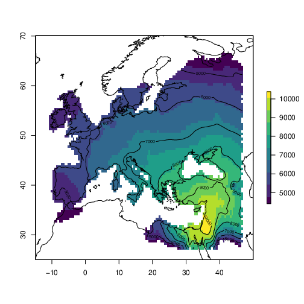

<h1>dispeRse</h1>
<h2>Simulation of demic diffusion with environmental constraints</h2>

**Jonas Gregorio de Souza** 
jonas.gregorio@gmail.com 
 

The growth rate is given by:

$$
\frac{\partial{N}}{\partial{t}} = N r \left( 1 - \frac{N}{K} \right)
$$

This is a test. Example formula:

$$
N_t = \frac{KN_0}{(K-N_0) e^{-rt} + N_0}
$$

The probability of fission:

$$
m =
    \begin{cases}
        0 & \text{if } \phi \leq \frac{N}{K} \\
        N - \phi K & \text{otherwise}
    \end{cases}
$$

