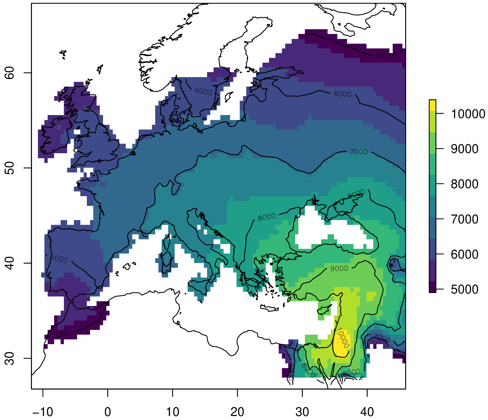

<h1>dispeRse</h1>
<h2>Simulation of demic diffusion with environmental constraints</h2>

**Jonas Gregorio de Souza**<br/>
jonas.gregorio@gmail.com<br/>
[](https://orcid.org/0000-0001-6032-4443)<br/>

<h3>Installation</h3>

To install from CRAN:

```R
install.packages("dispeRse")
```

To install from the github repository:

```R
devtools::install_github("jgregoriods/dispeRse")
```

<h3>1. Motivation</h3>

A recurrent demographic phenomenon during the Holocene was the growth and expansion of populations of farmers - observed in areas as diverse as Europe, Africa and South America. Attempts have been made to simulate those expansions using agent-based models, equation-based models and cellular automata (Fort et al. 2012; Souza et al. 2020, 2021; Russel et al. 2014).

Here, the package <code>dispeRse</code> is introduced. The package contains tools for simulating demic-diffusion processes, with particular attention to how the environment influences those processes. Growth and migration are modelled as density-dependent processes using equations and algorithms tested in previous simulation programs. At the same time, the package is intended to be flexible enough to be adapted to any case study.

The model is implemented in C and called from R with the function <code>simulate_dispersal</code>.

<h3>2. Model description</h3>

The simulation needs the following parameters:

<b>An environment layer:</b> this influences directly the maximum population density or carrying capacity $K$ that can be attained at each cell. Values must be scaled to [0,1] where 1 is the maximum density in the study area.

<b>A terrain layer:</b> this influences mobility by specifying barriers and corridors. Only values in {1,2} are considered, where 1 = barrier and 2 = corridor. Barriers can be mountains, deserts or any other geographical feature thought to block movement. Corridors can be rivers, coastlines or any other feature thought to facilitate movement.

<b>Origin centres:</b> this is a DataFrame with the x,y coordinates and start dates (years bp) of each centre of origin for the expansion.

<b>How many years</b> to run the simulation for.

<b>Annual growth rate</b> $r$ expressed as a decimal.

<b>Emigration threshold</b> $\phi$: a fraction of the carrying capacity above which emigration will happen. Expressed as a decimal.

<b>Generation time</b> $t$ in years.

<b>Migration distance</b>: how far (km) can the population disperse over a generation.

<b>Acceleration factor</b>: how much further can the population travel if located in a corridor.

<b>A power</b> $\gamma$ that determines the shape of the dependence of $r$ on the environment.

<b>Time steps</b> (in years) at which the environment and terrain are updated, if any. Notice that if updates are specified, the environment and terrain layers must be RasterStacks with a number of layers = number of updates + 1.

The model starts at the earliest date specified by the origin centres. The origin cells where the expansion is supposed to start from at that time have their population set to $K$, immediately fissioning and starting the expansion. At each time step, for each populated cell, growth is applied and migrants (if any) are dispersed to the neighboring cells. In what follows, each of these procedures is described.

<h3>3. Submodels</h3>

<h3>3.1. Growth</h3>

Growth is modelled as a density-dependent process by setting an upper boundary or saturation point, defined as the carrying capacity $K$ (Fig. 1). As the population approaches $K$, the growth rate $r$ decreases. It is assumed that population at the saturation point will remain in equilibrium as the birth and death rates cancel each other out. There is more than one proposal on how to model logistic growth; here, the Verhulst-Pearl equation is used for its simplicity (Tsoularis 2001):

$$
\frac{d{N}}{d{t}} = r N \left( 1 - \frac{N}{K} \right)
$$

Notice that, for economy, $r$, $N$ and $K$ are written for the local growth rate, population and carrying capacity. One could also write $r_{i}$, $N_{i}$ and $K_{i}$ for the parameters at each cell $i$. The solution to the equation above gives the new population after growth for $t$ years (Tsoularis 2001):

$$
N(t) = \frac{KN_0}{(K-N_0) e^{-rt} + N_0}
$$

Where $N_0$ is the initial population.

<p align="center"></p>
<p align="center"><b>Figure 1.</b> Number of new individuals (left) and total population size (right) over time for different carrying capacities.</p>

<h3>3.2. Emigration</h3>

Models of emigration as a density-dependent process usually assume that pressure to emigrate increases with population density due to diminishing returns. There are many competing models. Here, one of the simplest models, the asymptotic threshold model, is used (Hovestadt et al. 2010). Past a given threshold $\phi$, the probability of emigration grows asymptotically towards 100% as the population approaches carrying capacity (Fig. 2). The probability of individual emigration given a population density is given by Poethke and Hovestadt (2002) as:

$$
p(N_t) =
    \begin{cases}
        0 & \text{if } \phi \leq \frac{N_t}{K} \\
        1 - \frac{\phi}{N_t/K} & \text{otherwise}
    \end{cases}
$$

Consequently, for the entire population, the number of migrants $m$ at each time step can be predicted from the equation above as:

$$
m(N_t) =
    \begin{cases}
        0 & \text{if } \phi \leq \frac{N_t}{K} \\
        N_t - \phi K & \text{otherwise}
    \end{cases}
$$

Where $N_t$ is the population at the current time step after growth. In practice, the migrants are simply the percentage of the population that exceeds $\phi$.

<p align="center"></p>
<p align="center"><b>Figure 2.</b> Probability of emigration (left) and number of migrants (right) for different emigration thresholds.</p>

<h3>3.3. Mobility</h3>

In normal terrain, the migrants are redistributed to the eight cells in the Moore neighborhood, provided they have positive environment values and their population is below the emigration threshold. If a terrain layer is included with values for corridors and barriers, dispersal is affected in the following way:
1) population in cells marked as barriers will not disperse;
2) population in cells marked as corridors are allowed to disperse beyond the Moore neighborhood.

In the latter case, dispersal can be as far as the distance defined by the acceleration parameter, and only if the more distant cells are also in a corridor (Fig. 3). Redistribution of the population to the available cells occurs proportionally to the inverse of the square distance. Formally, the percentage of migrants that move to a cell $i$ among $N$ available cells is given by:

$$
\frac{1}{d_i^2} \left({\sum_{j=1}^N \frac{1}{d_j^2}}\right)^{-1}
$$

Where $d$ is the distance.

<p align="center"></p>
<p align="center"><b>Figure 3. a.</b> Cells considered for migration in normal terrain. <b>b.</b> Cells considered for migration in a corridor (light grey cells) with acceleration=3. Values are the inverse of the square distance to each cell.</p>

<h3>3.4. Effect of the environment</h3>

While the terrain layer affects mobility, the environment layer controls carrying capacity and growth rate. The environment layer represents the maximum population density that can be achieved in each cell relative to the maximum absolute density in the study area, expressed in the interval [0,1].

Each cell's carrying capacity is taken directly from the environment layer. The environment can be any variable, combined variables or transformations thereof on which $K$ is assumed to depend - one example being NPP (Tallavaara et al. 2018).

It is reasonable to assume that the maximum growth rate will also vary with the environment (Binford 2001). While the values of $K$ are taken directly from the environment layer, the dependence of $r$ on the latter is controlled by the parameter $\gamma$. Formally, for each cell indexed by $i$, the local growth rate $r_{i}=K_{i}^\gamma$. Thus, when $\gamma=0$, the growth rate is the same for all cells; when $\gamma=1$, it varies linearly with the environment, and so on.

As a useful procedure for simulating the effect of climate change, the environment and terrain layers can be updated at time steps defined by the user.

<h3>4. Example</h3>

We can test the model's performance on a well-known example, the Neolithic expansion from the Near East to Europe. In one of the attempts to simulate that phenomenon, Fort et al. (2012) conclude that the expansion started from Pre-Pottery Neolithic B sites at ca. 9000 cal BP and that including sea travel and mountains as barriers improved the results.

For replicating the experiment, the package <code>dispeRse</code> includes the following datasets:
* euro_npp: a RasterStack with net primary production (NPP) in Europe, North Africa and Near East between 11 ka and 4 ka in 1 ka intervals. Clipped to max 1350 and squared (to approximate the dependence, which is not linear, in Tallavaara et al. 2018). Scaled to [0,1]. NPP has been calculated using the Miami formula on paleoclimate simulations from Beyer et al. 2020 downloaded with the package <code>pastclim</code>.
* terr_npp: a Raster with elevation > 1750 m marked as barriers and major rivers and coastline marked as corridors.
* ppnb: coordinates and earliest dates (median cal BP) for Near Eastern sites of the Late Pre-Pottery Neolithic B period (from Pinhasi et al. 2005).
* euro_dates: coordinates and earliest dates (median cal BP) for European Neolithic sites (from Pinhasi et al. 2005).

```R
library(dispeRse)
library(raster)
library(rnaturalearth)
library(viridisLite)
```

```R
# for plotting
borders <- ne_download(scale=50, type="coastline", category="physical")
```

Since the environment will be updated at the time steps defined by the NPP stack, we need to create an equivalent stack for the terrain:

```R
terr <- raster::stack(replicate(8, euro_terr))
```

The following parameters will be used for the simulation: an emigration threshold of ca. 1/3 of $K$; an annual growth rate of 2.5%; and a generation time of 30 years. The default migration distance of 50 km per generation will be used, with the default acceleration of 3 (150 km) for corridors (rivers and coastline). We will run the simulation for 5500 years, which is enough for the entire Europe to be settled. These parameters are similar, though not identical to, the ones used by Fort et al. (2012).

```R
sim <- simulate_dispersal(euro_npp, terr, ppnb, 5500, phi=0.33, r=0.025, t=30, updates=seq(10000,4000,-1000))
[1] "Preparing rasters..."
[1] "Running model..."
[1] "Done."
```

Let's visualize the simulated arrival times:

```R
plot(sim, col=viridis(10), xlim=c(-12, 46), ylim=c(28, 66))
contour(sim, nlevels=5, add=TRUE)
plot(borders, add=TRUE)
```

<p align="center"></p>
<p align="center"><b>Figure 4.</b> Simulated Neolithic arrival times from the Near East to Europe.</p>

We can evaluate the model on the European Neolithic dates by taking the mean absolute error:

```R
sim_dates <- extract(sim, euro_dates)
print(mean(abs(euro_dates$date - sim_dates), na.rm=TRUE))
[1] 516.4514
```

In conclusion, our model has a similar error to the one reported in the original experiment. This is a reasonable fit, and we can probably achieve a smaller error by fine-tuning the parameters.

<h3>References</h3>

Beyer, R.M., Krapp, M. & Manica, A. (2020) High-resolution terrestrial climate, bioclimate and vegetation for the last 120,000 years. Sci Data 7, 236.

Binford, L. (2001) Constructing Frames of Reference: An Analytical Method for Archaeological Theory Building Using Ethnographic and Environmental Data Sets. Berkeley and Los Angeles: University of California Press.

Fort, J., Pujol, T., & Linden, M. (2012). Modelling the Neolithic Transition in the Near East and Europe. American Antiquity, 77(2), 203-219.

Hovestadt, T., Kubisch, A., Poethke, H-J. (2010). Information processing in models for density-dependent emigration: A comparison. Ecological Modelling, 221, 3, 405-410.

Souza, J.G., Alcaina Mateos, J. & Madella, M. (2020). Archaeological expansions in tropical South America during the late Holocene: Assessing the role of demic diffusion. PLOS ONE 15(4): e0232367.

Pinhasi R, Fort J, Ammerman AJ (2005). Tracing the Origin and Spread of Agriculture in Europe. PLOS Biology 3(12): e410.

Poethke, H-J. and Hovestadt, T. (2002). Evolution of density–and patch–size–dependent dispersal ratesProc. R. Soc. Lond. B.269: 637–645.

Russell T, Silva F, Steele J (2014). Modelling the Spread of Farming in the Bantu-Speaking Regions of Africa: An Archaeology-Based Phylogeography. PLOS ONE 9(1): e87854.

Souza, J.G., Noelli, F.S. & Madella, M. (2021). Reassessing the role of climate change in the Tupi expansion (South America, 5000–500 BP) J. R. Soc. Interface. 18: 20210499.

Tallavaara, M., Eronen, J.T. & Luoto, M. (2018). Productivity, biodiversity, and pathogens influence the global hunter-gatherer population density. PNAS 115 (6) 1232-1237.

Tsoularis, A. (2001). Analysis of logistic growth models, Research Letters in the Information and Mathematical Sciences, 2, 23-46.